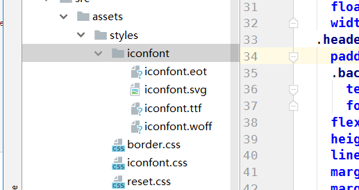
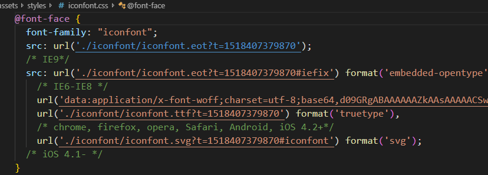
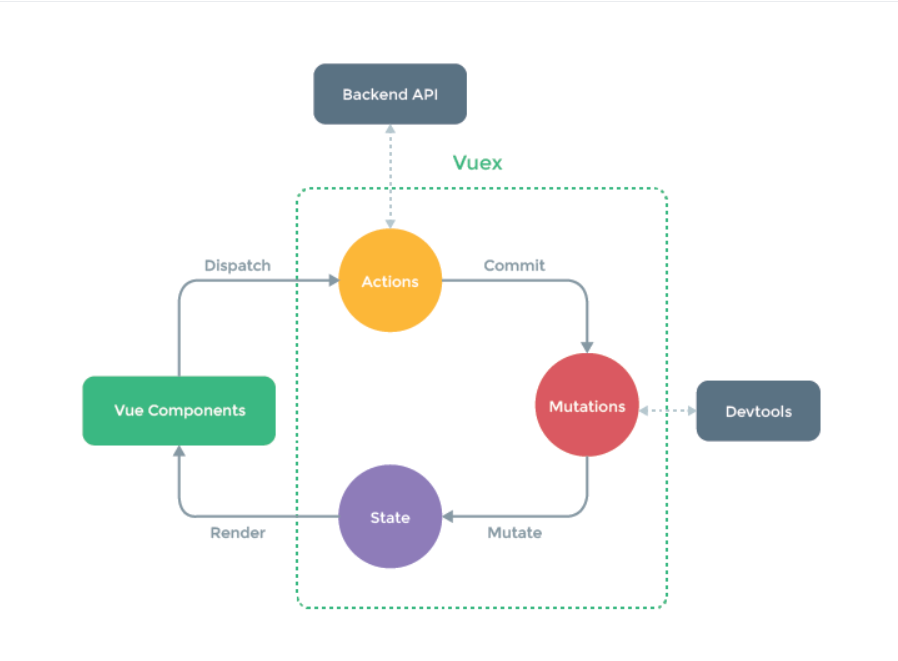

**技术栈和主要框架**

📦 Vue 全家桶：vue2.5 + vuex + vue-router + webpack

📌 ES6

📡 网络请求：axios

#分为三大组件开发，分别为home组件，city组件，detail组件
## home组件 
## city组件 
## detail组件

# 安装插件以及工具
1. axios: cnpm i axios --save
2. 移动端滑动插件：better-scroll:cnpm i better-scroll --save
3. 轮播插件：cnpm i vue-awesome-swiper@2.6.7 --save
4. 点击没延时：cnpm i fastclick --save
> 
- 本项目构建工具是用vue-cli3，模块开发，采用 stylus 预处理 CSS

- axios请求进行前后端数据交互
 
- 用 vuex 连接管理各个组件数据

-  cli2要自己安装
- npm install vuex --save

### home组件开发

### 头部组件开发
- 组件样式，不影响其他组件
-  1rem = html front-size = 50px

### 轮播图
1. 安装：npm install vue-awesome-swiper@2.6.7 --save

2. 在mian.js导入使用
- import VueAwesomeSwiper from 'vue-awesome-swiper'
- import 'swiper/dist/css/swiper.css'

- Vue.use(VueAwesomeSwiper)

3.  代码
- 

 -   <swiper :options="swiperOption">
 -      <swiper-slide v-for ='item of swiperList' :key="item.id">
 -        
 -      </swiper-slide>      
 -     

-   </swiper>
- 

4. swiper配置项：
- swiperOption: {
-   loop: true, 循环
-   pagination: '.swiper-pagination'  小圆圈
- }

5. 小圆点样式修改：组件的父元素样式用>>>可以控制没有在组件但在封装swiper的样式
- .wrapper >>> .swiper-pagination-bullet-active  对swiper组件样式的穿透
-  background: #ffffff

6. 样式
- 宽高比例自适应 比如宽比高 2：1
- overflow:hidden
- height:0
- padding-bottom:50%  (2:1)

### 图标区域逻辑实现

1. 添加icon

 - 进入https://www.iconfont.cn 添加返回，搜索，下箭头的icon，添加至项目，并且下载到本地

- 新建iconfront 目录，将一下4（后缀名带有eot,svg,ttf,woff）个文件移动到该目录，
- 
- 再将iconfront.css修改路径如图，再移动到styles目录
- 

1.1 vue-cli2可简化路径引入
- 进入 Build 下的  webpack.base.conf.js 第38行，添加目录搜索路径
- 

- 然后引入可简化为 @import '~styles/iconfont.css' (注：要加“~”)

2. 添加swiper 组件 （注意：每页展示8个，超过时进行分页，可以滚动）

3. 代码
- <swiper :options="swiperOption">
  - 图标8个页面，可以生成两个swiper-slide
  -   <swiper-slide v-for="( page,index) of Mypages" :key="index">
  -     

    -   里面小图标
  -       

  -         

  -           
   -        

  -         
{{item.desc}}

   -      

  -     

-     </swiper-slide>
 -  </swiper>

4. 添加计算属性(使每页展示8个，超过时进行分页，可以滚动)
 - computed: {
 -    pages() {
-     const pages = []
  -     this.list.forEach((item, index) => {
  -      var page = Math.floor(index / 8) //用来分页，也是把数组分成几个索引就是几页
   -      if (!pages[page]) {
   -        //如果数组不存在这个pages[page]，那就要给他空数组赋值给他
   -        pages[page] = []
   -      }
-      pages[page].push(item) //现在数组存在这个pages[page]，就可以往里面添加对象。。。这个不能用else， -     不然pages[page]==1时候没有添加给数组。因为都是一起执行的
  -     })
  -     return pages
 -    }
 -  }

5. 字体超出变成... 封装styl函数
- overminfun(){
 -  overflow hidden
 -  white-space nowrap
 -  text-overflow ellipsis
- }

### city组件开发
1. 使用better-scroll  联级滚动（配合overflow:hidden文本超出隐藏配合使用）
- 安装： npm install better-scroll

2. 在组件中的代码和引入

- 

 -  

-　　......
 - 　

- 

- 在组件中引入只作用此组件 import BScroll from 'better-scroll'
-  mounted() {
 -    this.scroll = new Bscroll(this.$refs.wrapper) //滚动
-   }, 

### city字母拖动的组件开发

- 绑定三个事件说明：

- touchstart : 触摸开始（手指放在触摸屏上）

- touchmove : 拖动（手指在触摸屏上移动）

- touchend : 触摸结束（手指从触摸屏上移开）

1. 当前第几个字母   = （触摸处浏览器页面的垂直坐标  -  A 字母距离搜索栏底部的距离） / 每个字母的高度
2. 节流限制 函数   handleTouchMove()  执行的频率

### city搜索功能的组件开发

1. for key in cities 循环遍历接口传进来的所有城市数据cities
 - cites:{'A':[{"id": 56,	"spell": "aba","name": "阿坝"}，{id:2,name:啊亚}]，'B':[{id:1,name:啊尔}，-- {id:2,name:啊亚}}

 2. 再对 this.cities[key] 遍历forEach里面的每一项是否跟双向绑定用户输入值关系
 - value['spell'].indexOf(this.keyword) > -1 || value.name.indexOf(this.keyword) > -1

 3. 跟关键字有关系的每一项value都添加到展示出来数组lists里面去  lists.push(value)

 4. 节流限制 函数 执行的频率

 ### Vuex实现数据共享及高级使用
 1.  安装 npm install vuex --save
 2. （cli2）在src目录下 新建state文件夹，新建index.js文件
 3. 创建一个 store
 - import Vue from 'vue'
- import Vuex from 'vuex'

- Vue.use(Vuex)
- export default new Vuex.Store({
-  state: {
-    city: '上海'
-  }
- })

4. main.js中创建根实例时，传入store

- import store from './store'
......
- new Vue({
-   el: '#app',
-  router,
-   store,
-  components: { App },
-  template: '<App/>'
- })
..

5. 然后子组件使用：
- - 获取城市名，直接渲染，就是直接使用state里面的内容
- {{this.$store.state.city}}

- 

6. actions 
- 一。给每个城市绑定一个方法： @click="cityToStore(inneritem.name)

- 二，在methods
-  cityToStore(city) {
 -    派发一个acfun city的 action
  -     this.$store.dispatch('acfun', city)
  -     this.$router.push('/')
 -    }

- 三丶在store.js中
-  actions: {
  - ctx上下文
  -   acfun(ctx, city) {
  -     ctx.commit('mufun', city)
  -   }

- 传递给mutations//改变数据
 -    mutations: {
 -    mufun(state, city) {
  -     state.city = city
  -   }

### vuex高级使用

1. 在要使用的组件import { mapState, mapMutations } from 'vuex'

- mapState指将state数据映射到city的计算属性中

- computed: mapState({
-     current_city: 'city'
- })

-  html写法：html数据变成
-  {{this.current_city}}

2. mapMutations ：

-  methods: {
-     cityToStore(city) {
-       this.mufun(city) //这个mu是直接mutations的方法
-       this.$router.push('/')
-     },
-     ...mapMutations(['mufun'])
-   }, 

## keep-alive优化网页性能
1.  keep-alive是Vue提供的一个抽象组件，用来对组件进行缓存，从而节省性能
 -  从页面内存加载路由界面，无需再渲染 -->
 -   <keep-alive>
 -     <router-view/>
 -   </keep-alive>

2.  当组件在keep-alive内被切换时组件的activated、deactivated这两个生命周期钩子函数会被执行

### 详细页面开发
1. banner 图的设计banner组件开发
2. DetailCity 城市活动组件开发
3. DetailHeader 创建一个公用组件 Gallary.vue
- 使用  vue-awesome-swiper 完成图片滚动以及动画渐隐渐现效果

- keepalive缓存会导致详情页面请求不变，需要配合activated钩子
- 也可以keepalive 不给detail加缓存：
-   <keep-alive exclude="Detail">
-   <router-view/>
- </keep-alive>

- 组件的名字在递归组件、keepalive exclude 和vue插件查看页面时可以用到

- vue-router滚动行为修改,在router/index中添加如下代码：
- scrollBehavior (to, from, savedPosition) {
-  return {x: 0, y: 0}
- }
